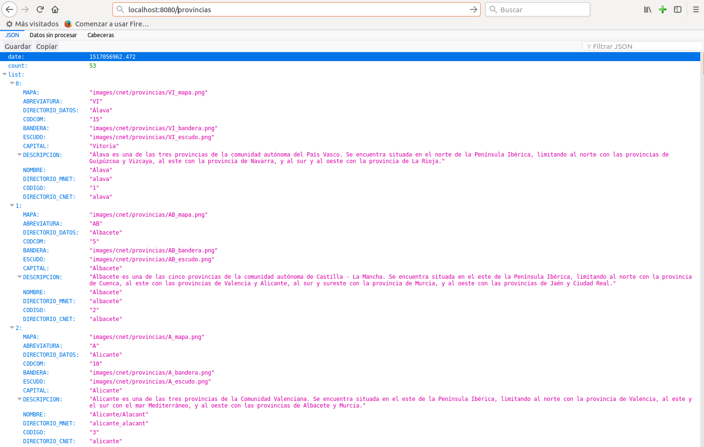

# Microservicio para datos MongoDB

Si estás diseñando una base de datos MongoDB, aprovisionando datos, desarrollando un servicio para esos datos, una aplicación que los consuma, etc., este sencillo servicio al estilo GraphQL puede serte muy útil.

Para su construcción he utilizado Python como lenguaje de desarrollo y la librería Bottle para el servicio REST. En lugar de un servicio REST al uso he realizado una implementación particular de la especificación GraphQL. Más información en https://github.com/garcilanga/Gestion_Datos_Fuentes_Externas/blob/master/RESTfull_vs_GraphQL.md

**MongoDB** es una base de datos NoSQL orientada a documentos, libre y de código abierto, y una de las más populares debido a lo simple de su configuración e inserción de datos y a su estructura flexible, que facilita los cambios en el modelo de datos. Más información en https://github.com/garcilanga/MongoDB-Instalacion

**Python** es un lenguaje de programación interpretado, de código abierto, multiplataforma, de tipado dinámico y multiparadigma, ya que soporta programación orientación a objetos, programación imperativa y, en menor medida, programación funcional. Más información en https://github.com/garcilanga/Python-Instalacion

**Bottle** es un framework web minimalista de Python, ligero, rápido, fácil de usar y muy adecuado para la construcción de servicios RESTful. Más información en https://github.com/garcilanga/Python-Bottle

> NOTA Este servicio ha sido implementado para realizar operaciones de consulta únicamente.

## Iniciar el servidor

La ejecución del microservicio se realiza por línea de comandos, invocando el comando de ejecución de python con el nombre del script y como parámetro obligatorio el nombre de la base de datos. Por ejemplo:
```
python server.py -mdb mi_base_de_datos
```


La lista completa de parámetros de configuración puede obtenerse con el parámetro -h:
```sh
python server.py -h
```
```sh
usage: server.py [-h] [-v] [-sh SERVER_HOST] [-sp SERVER_PORT]
                 [-mh MONGO_HOST] [-mp MONGO_PORT] [-mu MONGO_USER]
                 [-mw MONGO_PASSWORD] [-mdb MONGO_DBNAME]
                 [-mcol MONGO_COLLECTIONS]

optional arguments:
  -h, --help            show this help message and exit
  -v, --verbose         Default None.
  -sh SERVER_HOST, --server_host SERVER_HOST
                        Server host name. Default 'localhost'.
  -sp SERVER_HOST, --server_port SERVER_PORT
                        Server port number. Default 8080.
  -mh MONGO_HOST, --mongo_host MONGO_HOST
                        MongoDB host name. Default 'localhost'.
  -mp MONGO_PORT, --mongo_port MONGO_PORT
                        MongoDB port number. Default 27017.
  -mu MONGO_USER, --mongo_user MONGO_USER
                        MongoDB user. Default None.
  -mw MONGO_PASSWORD, --mongo_password MONGO_PASSWORD
                        MongoDB password. Default None.
  -mdb MONGO_DBNAME, --mongo_dbname MONGO_DBNAME
                        MongoDB database name. Mandatory.
  -mcol MONGO_COLLECTIONS, --mongo_collections MONGO_COLLECTIONS
                        MongoDB database collection list. Default '_all'.
```

Como puede verse, los parámetros de conexión y configuración por defecto de la base de datos son:
- _MONGO_HOST_: localhost
- _MONGO_PORT_: 27017
- _MONGO_USER_ y _MONGO_PASSWORD_: ninguno
- _MONGO_COLLECTIONS_: todas
- _MONGO_DBNAME_: por defecto ninguno, hay que indicarlo obligatoriamente.

Los parámetros por defecto del servicio son:
- _SERVER_HOST_: localhost
- _SERVER_PORT_: 8080

El parámetro _VERBOSE_ permite mostrar información adicional por consola.

Si tenemos una base de datos con varias colecciones pero solo queremos servir datos de algunas de ellas tendremos que indicarlo con el parámetro _mcol_, por ejemplo:
```
    python server.py -mdb mi_base_de_datos -mcol clientes,articulos,facturas
```


## Probar el servicio

Una vez arrancado el servidor, podemos consumir el servicio de distintas formas, por ejemplo con wget o curl por línea de comandos, desde una aplicación que estemos desarrollando o desde un navegador web:
```
http:\\localhost:8080
```

El acceso a la información se realiza mediante url's con el siguiente formato:
```
http:\\localhost:8080\\<coleccion>\<parámetros opcionales separados por cartacteres &>
```

<_colección_> son los endpoint o puntos de entrada y corresponden a los nombres de las colecciones de datos disponibles.

<_parámetros_> son los parámetos que configuran la consulta. Van se parados por caracteres '&' y pueden colocarse en cualquier orden. Los parámetros se escriben con la misma sintaxis que con las instrucciones find(), sort(), count()... en el cliente por consola de MongoDB . Los parámetros posibles son:
- **limit**: número total de registros a recuperar. Ej.: limit=10
- **skip**: número de registros a descartar (saltar) desde el inicio. Ej.: skip=1000
- **f**: (fields) datos a mostrar (equivale al SELECT en consultas SQL). Ej.: f={'NOMBRE':1,'DIRECCION':1}
- **q**: (query) filtro de datos (equivale al WHERE en consultas SQL). Ej.: q={'PROVINCIA':'Madrid','PRECIO':{'$lt':100}}
- **s**: (sort) ordenación de los datos (equivale al ORDER BY en consultas SQL). Ej.: s=[('PRECIO',1),('ESTRELLAS',-1)]
- **count**: número total de registros que cumplen la condición establecida con el parámetro **q**. Si este parámetro está presenete sólo se tiene en cuenta el parámetro **q**, los demas son descartados.

Ejemplos de consultas de datos, suponiendo una base de datos de hoteles con una colección de hoteles:

- Múmero total de hoteles:
```html
http://localhost:8080/hoteles/count
```

- Múmero total de hoteles en Madrid:
```
http://localhost:8080/hoteles/count&q={'CIUDAD':'Madrid'}
```

- Los 5 primeros hoteles con 2 ó más estrellas:
```
http://localhost:8080/hoteles/q={'ESTRELLAS':{'$gte':2}}&limit=5
```

- Los 5 siguientes:
```
http://localhost:8080/hoteles/q={'ESTRELLAS':{'$gte':2}}&limit=5&skip=5
```

- Ordenando por precio de menos a mayor:
```
http://localhost:8080/hoteles/q={'ESTRELLAS':{'$gte':2}}&limit=5&skip=5&s=[('PRECIO',1)]
```

- Mostrando únicamente nombre, dirección y precio:
```
http://localhost:8080/hoteles/q={'ESTRELLAS':{'$gte':2}}&limit=5&skip=5&s=[('PRECIO',1)]&f={'NOMBRE':1,'DIRECCION':1,'PRECIO':1}

```
Ejemplo de una consulta a una base de datos sobre provincias de España:


